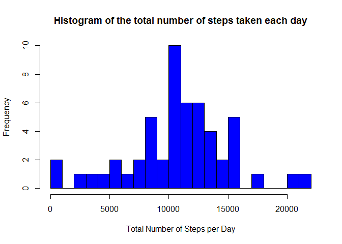
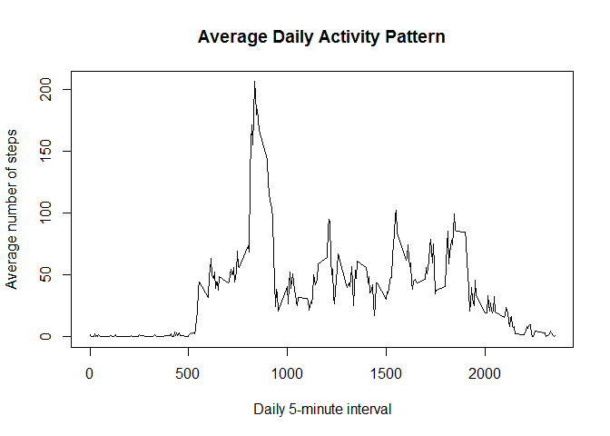
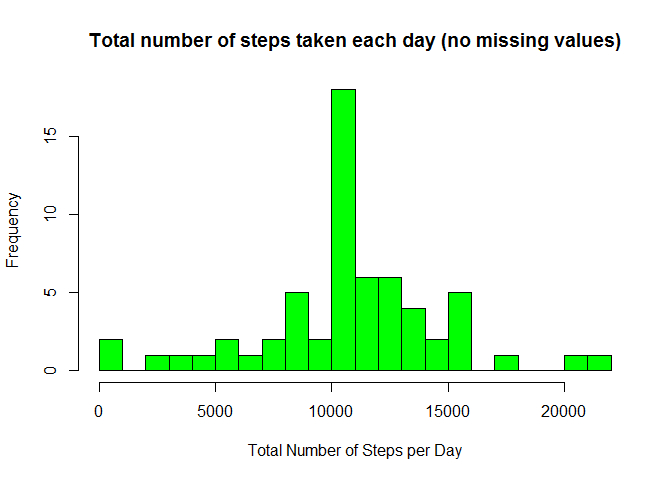
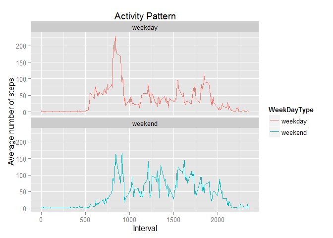

# Reproducible Research: Peer Assessment 1

This assignment makes use of data from a personal activity monitoring device. This device collects data at 5 minute intervals through out the day. The data consists of two months of data from an anonymous individual collected during the months of October and November, 2012 and include the number of steps taken in 5 minute intervals each day.

##Loading and preprocessing the data


```r
#load activity data
dataSet <- read.csv("activity.csv")

#convert date variable to Date data type
dataSet$date <- as.Date(dataSet$date)
```

##What is mean total number of steps taken per day?

1. Total Number of steps taken per day


```r
#Total Number of steps taken per day
totalStepsperDay <- aggregate(steps ~ date, dataSet, sum)
head(totalStepsperDay)
```

```
##         date steps
## 1 2012-10-02   126
## 2 2012-10-03 11352
## 3 2012-10-04 12116
## 4 2012-10-05 13294
## 5 2012-10-06 15420
## 6 2012-10-07 11015
```

2. Histogram of the total number of steps taken each day


```r
#histogram
hist(totalStepsperDay$steps, col = "Blue", xlab = "Total Number of Steps per Day", main = "Histogram of the total number of steps taken each day", breaks = 20)
```

 

3. Mean and median of the total number of steps taken per day


```r
#mean
meanSteps <- mean(totalStepsperDay$steps)

#median
medianSteps <- median(totalStepsperDay$steps)
```

Mean is 10766.19, and median is 10765.

##What is the average daily activity pattern?

1. Time series plot of the 5-minute interval and the average number of steps taken, averaged across all days.


```r
#average number of steps per interval
avgStepsperInterval <- aggregate(steps ~ interval, dataSet, mean)
head(avgStepsperInterval)
```

```
##   interval     steps
## 1        0 1.7169811
## 2        5 0.3396226
## 3       10 0.1320755
## 4       15 0.1509434
## 5       20 0.0754717
## 6       25 2.0943396
```

```r
#plot
plot(avgStepsperInterval$interval, avgStepsperInterval$steps, type = "l",xlab = "Daily 5-minute interval", ylab = "Average number of steps", main = "Average Daily Activity Pattern")
```

 

2. Determine which 5-minute interval, on average across all the days in the dataset, contains the maximum number of steps


```r
#max Steps
maxSteps <- max(avgStepsperInterval$steps)

#interval that contains max Steps
maxStepInterval <- avgStepsperInterval[avgStepsperInterval$steps == maxSteps,][["interval"]]
```

The 5-minute interval that contains the maximum number of average steps (206.1698113 steps) is interval 835.

##Imputing missing values

1. Calculate the total number of missing values in the dataset (i.e. the total number of rows with NAs)


```r
#number of rows with NAs
NArows <-  nrow(dataSet[is.na(dataSet$steps) | is.na(dataSet$date) | is.na(dataSet$interval),])
```

There are 2304 missing values in the dataset.

2. Strategy for filling in missing values

I am going to use the average number of steps per 5-minute interval across all dates to fill in missing values for each 5-minute interval. I will round the average number of steps to a whole number for each interval.

3. Create a new dataset that is equal to the original dataset but with the missing data filled in.


```r
#round the average number of steps to a whole number
avgStepsperInterval$AvgSteps <- round(avgStepsperInterval$steps)

#create new dataset by merging original data set with averages dataset
dataNew <- merge(x = dataSet, y = avgStepsperInterval[, c("interval","AvgSteps")], by = "interval", all = TRUE)

#fill in missing values
dataNew$steps[is.na(dataNew$steps)] <- dataNew$AvgSteps[is.na(dataNew$steps)]

#clean up dataset
dataNew <- dataNew[, c("steps","date","interval")]

#new data set
head(dataNew)
```

```
##   steps       date interval
## 1     2 2012-10-01        0
## 2     0 2012-11-23        0
## 3     0 2012-10-28        0
## 4     0 2012-11-06        0
## 5     0 2012-11-24        0
## 6     0 2012-11-15        0
```

4. Make a histogram of the total number of steps taken each day and Calculate and report the mean and median total number of steps taken per day. Do these values differ from the estimates from the first part of the assignment? What is the impact of imputing missing data on the estimates of the total daily number of steps?

Histogram of the total number of steps taken each day (after filling in missing values)


```r
#Total Number of steps taken per day
totalStepsperDayNew <- aggregate(steps ~ date, dataNew, sum)

#histogram
hist(totalStepsperDayNew$steps, col = "green", xlab = "Total Number of Steps per Day", main = "Total number of steps taken each day (no missing values)", breaks = 20)
```

 

Mean and median of the total number of steps taken per day (after filling in missing values)


```r
#mean
meanStepsNew <- mean(totalStepsperDayNew$steps)

#median
medianStepsNew <- median(totalStepsperDayNew$steps)
```

Mean is 10765.64, and median is 10762.

From these results we can see that the values differ only slightly from the estimates from the first part of the assignment. The new mean and median are slightly smaller than the original values. The impact of imputing missing data was not significant on the estimates of the total daily number of steps.

##Are there differences in activity patterns between weekdays and weekends?

1. Create a new factor variable in the dataset with two levels - "weekday" and "weekend" indicating whether a given date is a weekday or weekend day.


```r
#create a new factor variable
dataNew$WeekDayType <- weekdays(dataNew$date)
dataNew$WeekDayType <- ifelse(dataNew$WeekDayType %in% c("Saturday","Sunday"), yes = "weekend", "weekday")
dataNew$WeekDayType <- as.factor(dataNew$WeekDayType)
head(dataNew)
```

```
##   steps       date interval WeekDayType
## 1     2 2012-10-01        0     weekday
## 2     0 2012-11-23        0     weekday
## 3     0 2012-10-28        0     weekend
## 4     0 2012-11-06        0     weekday
## 5     0 2012-11-24        0     weekend
## 6     0 2012-11-15        0     weekday
```

2. Make a panel plot containing a time series plot (i.e. type = "l") of the 5-minute interval (x-axis) and the average number of steps taken, averaged across all weekday days or weekend days (y-axis).


```r
#average number of steps per interval for weekdays/weekends
avgStepsperIntervalNew <- aggregate(steps ~ interval + WeekDayType, dataNew, mean)
head(avgStepsperIntervalNew)
```

```
##   interval WeekDayType      steps
## 1        0     weekday 2.28888889
## 2        5     weekday 0.40000000
## 3       10     weekday 0.15555556
## 4       15     weekday 0.17777778
## 5       20     weekday 0.08888889
## 6       25     weekday 1.57777778
```

```r
#Plot Data
library(ggplot2)
g<-ggplot(avgStepsperIntervalNew, aes(interval, steps))+facet_wrap(~ WeekDayType, nrow=2)+ geom_line(aes(color=WeekDayType)) + labs(x = "Interval") + labs(title = "Activity Pattern") + labs(y= "Average number of steps")
g
```

 
